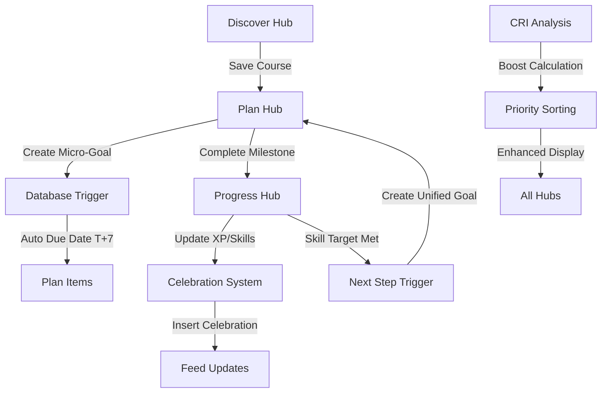

# P3/P4 Development Notes: Cross-Hub Triggers + Today Dashboard

## Overview

This document describes the implementation of Phase 3 (Cross-Hub Triggers) and Phase 4 (Today Dashboard) features for the career platform.

## Cross-Hub Trigger Flows



### Trigger Details

1. **Discover → Plan**: Saving a course auto-creates micro-goal with `added_from_hub='discover'` and due date T+7 days
2. **Plan → Progress**: Milestone completion triggers XP awards, celebration moments, and skill tree updates
3. **Progress → Plan**: Skill mastery triggers "Take Next Step" suggestions and auto-goal creation
4. **CRI Boost Integration**: Career Readiness Index gaps boost item priority and display

## Query Cache Management

All query keys are centralized in `src/lib/queryKeys.ts`:

```typescript
export const QUERY_KEYS = {
  SKILL_GAPS: (userId?: string) => ['skill-gaps', userId],
  UNIFIED_RECOMMENDATIONS: (userId?: string) => ['unified-recommendations', userId],
  // ... more keys
}
```

### Invalidation Points

- **Cross-hub saves**: Invalidates `skill-gaps`, `unified-recommendations`, `plan-items`, `micro-goals`
- **Milestone completion**: Invalidates `celebration-moments`, `completion-triggers`, `gamification-data`
- **Skill upgrades**: Invalidates all recommendation and progress queries

## Telemetry Events

All events are tracked through `src/lib/telemetry.ts`:

### Feed Events
- `feed_card_view` - When recommendation card is viewed
- `feed_primary_cta_click` - When primary action button is clicked
- `save_to_plan` - When item is saved to plan

### Progress Events  
- `roadmap_step_completed` - When roadmap step is marked complete
- `skill_node_upgraded` - When skill reaches new level

### Today Dashboard Events
- `today_next_step_rendered` - When next step card is displayed
- `today_quick_win_start` - When quick win is started
- `today_unstick_created` - When unstick action is triggered

### Usage Example
```typescript
import { telemetry } from '@/lib/telemetry';

// Track save to plan with CRI boost
telemetry.saveToPlan(userId, 'quick_win', 'today_dashboard', 15.5);

// Track skill upgrade
telemetry.skillUpgraded(userId, 'React', 3);
```

## Feature Flags

Feature rollout is controlled through `src/lib/featureFlags.ts`:

### Flags Available
- `unifiedTodayDashboard` - Controls new Today Dashboard (default: dev/test only)
- `crossHubTriggers` - Controls cross-hub automation
- `criBoostDisplay` - Controls CRI boost chip display
- `advancedTelemetry` - Controls detailed event tracking

### Enabling in Production
Add query parameters to URL:
- `?enableToday=1` - Enable Today Dashboard
- `?enableCrossHub=1` - Enable cross-hub triggers

### Usage
```typescript
import { useFeatureFlags } from '@/lib/featureFlags';

const featureFlags = useFeatureFlags();
if (featureFlags.unifiedTodayDashboard) {
  // Show new dashboard
}
```

## Time Parsing Rules

Quick Wins filtering uses `parseTimeEstimateToMinutes()` from `src/utils/time.ts`:

### Supported Formats
- **Basic**: "30min", "45m", "1hr", "2hrs"  
- **Verbose**: "30 minutes", "1 hour", "2 hours"
- **Decimal**: "0.5hr", "1.5hrs"
- **Ranges**: "30–45min", "2-3hrs" (takes lower bound)
- **Complex**: "1h 15m", "2hr 30min"
- **Normalized**: "~45min", "≈ 30 min", "About 2 hours"

### Quick Wins Filter
- **Range**: 30-60 minutes inclusive
- **Limit**: Maximum 3 items displayed
- **Sorting**: By priority score with CRI boost applied

## Today Dashboard Components

### Next Step Card
- Shows top priority recommendation from unified feed
- Displays time estimate, progress bar, and CRI boost chip
- Primary action saves as `type: 'quick_win'` to plan

### Quick Wins Section  
- Filters recommendations to 30-60 minute range
- Shows up to 3 items with CRI boost indicators
- Each item saves as `type: 'quick_win'` when started

### Unstick Prompt
- Appears after ≥3 days of user inactivity
- Creates `type: 'micro_task'` when activated
- Includes `metadata.days_inactive` for tracking

## Data Shapes

### Unified SaveToPlanItem
```typescript
interface SaveToPlanItem {
  type: 'course' | 'career_path' | 'quick_win' | 'micro_task' | 'skill';
  id: string;
  title: string;
  description?: string;
  timeEstimate?: string;
  skillTags?: string[];
  priority?: 'high' | 'medium' | 'low';
  metadata?: Record<string, any>;
}
```

### CRI Boost Fields
```typescript
interface UnifiedRecommendation {
  // ... other fields
  criBoost?: number;        // Percentage boost (e.g., 15.5)
  criExplanation?: string;  // Short explanation
}
```

## Testing

### Cypress Test Files
- `cypress/e2e/cross_hub_triggers.cy.ts` - Cross-hub integration flows
- `cypress/e2e/plan_today_dashboard.cy.ts` - Today Dashboard functionality

### Key Test Scenarios
1. **Cross-hub saves**: Verify micro-goal creation and due dates
2. **CRI display**: Check chips only appear when `criBoost > 0`  
3. **Time filtering**: Confirm 30-60 minute Quick Wins range
4. **Feature flags**: Test graceful fallbacks when disabled
5. **Event tracking**: Verify telemetry events fire correctly

### Test Data Patterns
```typescript
// Use data-testid for stable selectors
cy.get('[data-testid=\"next-step-card\"]')
cy.get('[data-testid=\"cri-boost-chip\"]')
cy.get('[data-testid=\"quick-win-0\"]')

// Wait for API calls to complete
cy.wait('@unifiedRecommendations')
cy.wait('@saveToPlan')
```

## Performance Optimizations

### Hook Optimizations
- `useCallback` for all action handlers to prevent re-renders
- `useMemo` for expensive filtering operations (Quick Wins)
- Debounced recomputation when feed data changes (200ms)

### Query Optimizations
- Centralized invalidation through `refreshCrossHubData()`
- Selective query invalidation based on action type
- Proper query key dependencies for cache efficiency

## Development Workflow

### Making Changes
1. Update types in `src/types/` if data shapes change
2. Modify query keys in `src/lib/queryKeys.ts` if adding new queries
3. Add telemetry events to `src/lib/telemetry.ts` for tracking
4. Update feature flags in `src/lib/featureFlags.ts` for rollout control
5. Update Cypress tests for new functionality

### Debugging
- Check browser console for telemetry events in development
- Use React DevTools to inspect hook state and re-renders
- Monitor network tab for query invalidation patterns
- Use Supabase dashboard to verify database triggers

## Database Architecture

### Idempotency Safeguards
- **career_goals_user_source_uidx**: Prevents duplicate micro-goals from same source
- **auto_create_micro_goal()**: Database trigger with idempotency checks
- **handle_milestone_completion()**: Triggers celebrations and cross-hub updates

### Cross-Hub Triggers
1. **Discover → Plan**: Auto micro-goal creation with T+7 due dates
2. **Plan → Progress**: Milestone completion triggers celebrations
3. **Progress → Plan**: Skill mastery creates next step suggestions

## Security Considerations

### Current Security Warnings
The database has some security warnings that should be addressed:
- **ERROR**: Security Definer View detected
- **WARN**: Function search paths need hardening
- **WARN**: Extensions in public schema

### Recommendations
1. Review all SECURITY DEFINER functions for least privilege
2. Set explicit search_path in function definitions
3. Move extensions to dedicated schemas where possible

## Known Limitations

1. **Time Parsing**: Complex formats like "1 hour and 15 minutes" now supported ✅
2. **CRI Calculation**: Only considers immediate skill gaps, not career trajectory
3. **Feature Flags**: Require page refresh when changed via query params
4. **Telemetry**: Events logged to console in development, need production analytics setup
5. **Database Security**: Some security warnings need attention (see above)

## Future Enhancements

- Real-time updates for cross-hub triggers via WebSocket
- Machine learning-based recommendation ranking
- Advanced time estimation using historical completion data
- A/B testing framework integration for feature flags
