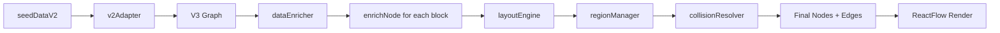

# EduTree V3 Technical Specification

**Version:** 1.0  
**Date:** 2025-10-06  
**Related:** [ADR 001](./001-edutree-v3-surgical-rewrite.md)

## File Structure

```
src/pages/EduTree/
├── v3/
│   ├── index.tsx                    # Route entry point
│   ├── EduTreeV3Canvas.tsx          # ReactFlow container
│   ├── types/
│   │   └── v3.ts                    # V3-specific types (V3Node, V3Edge, etc.)
│   ├── engine/
│   │   ├── layoutEngine.ts          # Pure layout calculation (~150 lines)
│   │   ├── regionManager.ts         # Program/track region logic (~80 lines)
│   │   ├── collisionResolver.ts     # Overlap resolution (~100 lines)
│   │   ├── dataEnricher.ts          # Single-pass enrichment (~120 lines)
│   │   └── index.ts                 # Orchestrator: buildEduTreeGraph()
│   ├── components/
│   │   ├── nodes/
│   │   │   ├── YearCardNode.tsx     # Collapsible year container
│   │   │   ├── TrackBundleNode.tsx  # SE/DS fork with stats
│   │   │   ├── RequirementNode.tsx  # Minimal block (reuse V2 base)
│   │   │   └── GateNode.tsx         # Program/track gates
│   │   ├── panel/
│   │   │   ├── DockedPanel.tsx      # Right-side panel container
│   │   │   ├── tabs/
│   │   │   │   ├── OverviewTab.tsx
│   │   │   │   ├── CoursesTab.tsx
│   │   │   │   ├── EligibilityTab.tsx
│   │   │   │   ├── CostTab.tsx
│   │   │   │   └── OutcomesTab.tsx
│   │   └── controls/
│   │       └── V3Controls.tsx       # Enhanced toolbar
│   ├── hooks/
│   │   ├── usePanelState.ts         # Panel open/close/tab state
│   │   ├── useExpansionState.ts     # Track which nodes expanded
│   │   └── useV3Layout.ts           # Layout engine orchestration
│   ├── utils/
│   │   ├── layoutTokensV3.ts        # Immutable layout constants
│   │   ├── overlapValidator.ts      # Collision detection validator
│   │   └── v2Adapter.ts             # Convert seedDataV2 → V3 format
│   └── __tests__/
│       ├── layoutEngine.test.ts
│       ├── collisionResolver.test.ts
│       ├── overlapValidator.test.ts
│       └── fixtures.ts              # Mock data (3 programs)
```

## Core Types

```typescript
// src/pages/EduTree/v3/types/v3.ts

export type NodeType = 'year' | 'track-bundle' | 'requirement' | 'gate';
export type TrackId = 'se' | 'ds';

export interface V3Node {
  id: string;
  type: NodeType;
  data: V3NodeData;
  position: Position;
  parentId?: string;  // For year grouping
}

export type V3NodeData = 
  | YearNodeData 
  | TrackBundleData 
  | RequirementNodeData 
  | GateNodeData;

export interface YearNodeData {
  year: number;
  totalCredits: number;
  completedCredits: number;
  isExpanded: boolean;
}

export interface TrackBundleData {
  trackId: TrackId;
  title: string;
  stats: { courses: number; credits: number; avgSalary: string };
  isSelected: boolean;
  isExpanded: boolean;
}

export interface RequirementNodeData {
  block: RequirementBlock;
  courses: EduCourse[];
  isComplete: boolean;
  isUnlocked: boolean;
  regionId: string;  // 'cs-upper' | 'it-lower' | 'se-corridor' | 'ds-corridor'
}

export interface Position {
  x: number;
  y: number;
}

export interface Region {
  id: string;
  bounds: { minY: number; maxY: number };
  trackId?: TrackId;
}
```

## Data Flow



### Step-by-Step

1. **Adapt V2 Data**
```typescript
// v2Adapter.ts
export function adaptSeedDataV2(seedData: SeedDataV2): V3Graph {
  return {
    blocks: seedData.blocks.map(b => ({ ...b, id: b.id })), // Ensure stable IDs
    prerequisites: seedData.prerequisites,
    yearGroups: computeYearGroups(seedData.blocks)
  };
}
```

2. **Enrich Nodes (Single Pass)**
```typescript
// dataEnricher.ts
export function enrichNode(
  block: RequirementBlock,
  context: EnrichmentContext
): V3Node {
  const id = block.id; // No fallbacks
  
  return {
    id,
    type: 'requirement',
    data: {
      block,
      courses: context.marketplace.getCourses(id),
      isComplete: isBlockComplete(block, context.completedCourses),
      isUnlocked: isBlockUnlocked(block, context.prerequisites),
      regionId: getRegionId(block)
    },
    position: { x: 0, y: 0 } // Layout engine fills this
  };
}
```

3. **Calculate Layout**
```typescript
// layoutEngine.ts
export function calculateLayout(
  nodes: V3Node[],
  tokens: typeof LAYOUT_TOKENS
): Map<string, Position> {
  const positions = new Map<string, Position>();
  
  // Group by year
  const byYear = groupBy(nodes, n => n.data.block?.level_year ?? 0);
  
  for (const [year, yearNodes] of byYear) {
    const baseX = tokens.YEAR_COL[`Y${year}` as keyof typeof tokens.YEAR_COL];
    
    yearNodes.forEach((node, idx) => {
      positions.set(node.id, {
        x: snapToGrid(baseX, tokens.GRID),
        y: snapToGrid(tokens.LANE_GAP * idx, tokens.GRID)
      });
    });
  }
  
  return positions;
}
```

4. **Resolve Collisions**
```typescript
// collisionResolver.ts
export function resolveCollisions(
  nodes: V3Node[],
  regions: Map<string, Region>,
  tokens: typeof LAYOUT_TOKENS
): V3Node[] {
  const resolved = [...nodes];
  
  // Use MAX_NODE_HEIGHT for all collision checks
  const safeHeight = tokens.NODE_MAX_HEIGHT;
  
  for (let i = 0; i < resolved.length; i++) {
    for (let j = i + 1; j < resolved.length; j++) {
      if (hasOverlap(resolved[i], resolved[j], safeHeight, tokens.NODE_WIDTH)) {
        // Push j down by LANE_GAP
        resolved[j].position.y += safeHeight + tokens.LANE_GAP;
      }
    }
  }
  
  return resolved;
}

function hasOverlap(a: V3Node, b: V3Node, height: number, width: number): boolean {
  const padding = 8; // Safety margin
  return !(
    a.position.x + width + padding < b.position.x ||
    a.position.x > b.position.x + width + padding ||
    a.position.y + height + padding < b.position.y ||
    a.position.y > b.position.y + height + padding
  );
}
```

## Layout Tokens (Immutable)

```typescript
// utils/layoutTokensV3.ts
export const LAYOUT_TOKENS = {
  NODE_WIDTH: 180,
  NODE_BASE_HEIGHT: 120,
  NODE_MAX_HEIGHT: 250,
  LANE_GAP: 60,
  YEAR_COL: { Y1: 300, Y2: 700, Y3: 1100, Y4: 1500 },
  TRACK_COLUMN_OFFSET: 56,
  COL_TOLERANCE: 48,
  REGION_GUTTER: 24,
  TRACK_GUTTER: 16,
  GRID: 8
} as const;

// Enforce immutability
Object.freeze(LAYOUT_TOKENS);
```

## UI Components

### YearCardNode
```typescript
// Shows: "Year 3 • 24 credits • 8 courses"
// Click → expands to show child requirement nodes
// Collapsed: single 120px tall card
// Expanded: children visible below, card stays at top
```

### TrackBundleNode
```typescript
// Shows at Y2→Y3 fork: "SE Track | DS Track"
// Each side shows: "12 courses • 36 credits • $95k avg"
// Click SE → SE expands, DS dims (CSS opacity: 0.3)
// No remounting, instant transition
```

### DockedPanel
```typescript
// Fixed right side, 400px wide, slide in/out
// Tabs: Overview | Courses | Eligibility | Cost | Outcomes
// usePanelState hook manages state
// No ReactFlow remount on open/close
```

## Testing Strategy

### Unit Tests (Required)
```typescript
// layoutEngine.test.ts
describe('layoutEngine', () => {
  it('assigns correct X for each year column', () => {
    const nodes = [mockNode({ year: 1 }), mockNode({ year: 2 })];
    const positions = calculateLayout(nodes, LAYOUT_TOKENS);
    expect(positions.get('y1-node')?.x).toBe(300);
    expect(positions.get('y2-node')?.x).toBe(700);
  });
});

// collisionResolver.test.ts
it('resolves overlap for tall nodes', () => {
  const nodes = [
    mockNode({ y: 100, height: 250 }),
    mockNode({ y: 150, height: 250 })
  ];
  const resolved = resolveCollisions(nodes, new Map(), LAYOUT_TOKENS);
  const validator = validateNoOverlaps(resolved);
  expect(validator.hasOverlaps).toBe(false);
});
```

### Cypress E2E (Required)
```typescript
// cypress/e2e/edutree-v3.cy.ts
it('expands Year 3 on click, shows SE/DS tracks', () => {
  cy.visit('/edu-tree-v3');
  cy.get('[data-node-type="year"][data-year="3"]').click();
  cy.get('[data-node-type="track-bundle"][data-track="se"]').should('be.visible');
  cy.get('[data-node-type="track-bundle"][data-track="ds"]').should('be.visible');
});

it('selecting SE track dims DS track', () => {
  cy.get('[data-track="se"]').click();
  cy.get('[data-track="se"]').should('have.class', 'opacity-100');
  cy.get('[data-track="ds"]').should('have.class', 'opacity-30');
});
```

## Performance Budgets

| Metric | Budget | Measurement |
|--------|--------|-------------|
| Initial render | <600ms | Chrome DevTools Performance |
| Panel open | <120ms | `performance.mark()` |
| Selection | <75ms | `performance.mark()` |
| Collision resolve | <50ms | Unit test assertion |

## Accessibility

- Keyboard navigation: Arrow keys move between nodes, Enter expands, Esc closes panel
- ARIA roles: `role="tree"` on canvas, `role="treeitem"` on nodes
- Focus visible: 2px outline on focused nodes
- Screen reader: Announce "Year 3, 24 credits, collapsed. Press Enter to expand"
- axe-core: Fail CI on critical violations

## Feature Flag

```typescript
// LocalStorage flag
localStorage.setItem('flags.eduTreeV3', 'true');

// Route guard
if (!localStorage.getItem('flags.eduTreeV3')) {
  return <Navigate to="/edu-tree" />;
}
```

## Rollout Plan

1. **Week 1-2:** Build engine + tests (no UI)
2. **Week 3:** Build UI components + panel
3. **Week 4:** Internal alpha (5 users, instrumentation)
4. **Week 5:** Beta (50 users, A/B test vs V2)
5. **Week 6:** GA if metrics pass (default on for new users)

## Success Criteria

✅ `validateNoOverlaps()` returns `false` for `hasOverlaps`  
✅ Default view shows ≤15 nodes  
✅ Panel opens in <120ms  
✅ Zero ReactFlow remounts on interaction  
✅ Keyboard nav works end-to-end  
✅ axe-core passes all critical checks  
✅ Performance budgets met for 200-node graph
