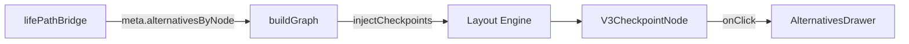

# ADR-008: Checkpoint Node Rendering (Phase 3)

**Status:** In Progress  
**Date:** 2025-01-08  
**Deciders:** Engineering Team  

## Context

Phase 2 successfully counted alternatives in `meta.alternativesByNode` without rendering them. Phase 3 injects **checkpoint nodes** at fork points to expose these alternatives to users, allowing path selection through an interactive UI.

### Goals

1. **Visual Clarity**: Checkpoints must be visually distinct from regular nodes (track-bundle, gate).
2. **Grid Alignment**: Maintain 8px grid snap for all checkpoint nodes.
3. **Zero Geometry Shift**: Checkpoint injection must not disturb existing node positions.
4. **Performance**: Checkpoint rendering must complete in <150ms for graphs with ≤10 checkpoints.

## Decision

### Checkpoint Detection

Use `meta.alternativesByNode` from Phase 2 bridge:

```typescript
const forkNodeIds = Object.keys(meta.alternativesByNode).filter(
  nodeId => meta.alternativesByNode[nodeId] >= 1
);
```

### Checkpoint Injection

Insert checkpoint nodes via `checkpointManager.ts`:

- **Stable IDs**: `checkpoint-{sourceNodeId}` (deterministic, snapshot-friendly)
- **Position**: Offset from source node by `TIER_SPACING_PX`
- **Type**: New `checkpoint` NodeType
- **Data**: Includes `alternativeCount` and `sourceNodeId` for drawer linkage

### Visual Design

**Checkpoint Node (`V3CheckpointNode.tsx`)**:
- Diamond/badge shape (rounded rectangle with warning gradient)
- GitBranch icon + alternative count
- Hover hint: "Click to view options"
- Click handler: Opens alternatives drawer (Phase 3b)

**Colors** (from design system):
- Background: `bg-gradient-to-br from-warning/20 to-warning/10`
- Border: `border-2 border-warning`
- Icon: `text-warning`

### Engine Integration

Update `buildGraph()` signature to accept `BridgeMeta`:

```typescript
export function buildGraph(graph: V3Graph, meta?: BridgeMeta): V3Graph {
  // 0) Inject checkpoints (Phase 3)
  if (meta && Object.keys(meta.alternativesByNode).length > 0) {
    const result = injectCheckpoints(graph.nodes, graph.edges, meta);
    // ... continue with layout
  }
}
```

### Data Flow



## Consequences

### Benefits

- **User Control**: Exposes alternatives without overwhelming the spine view.
- **Stable IDs**: Checkpoint IDs are deterministic (safe for React keys, deep links).
- **Grid Aligned**: All checkpoints snap to 8px grid (no sub-pixel rendering).
- **Phase 3b Ready**: Data structure supports drawer implementation (alternative ranking, selection state).

### Trade-offs

- **Node Count Increase**: Graphs with N forks now have N+7 nodes (may affect performance at scale).
- **Layout Complexity**: Checkpoint injection runs before layout engine (must preserve grid invariants).
- **Type System**: Adds `checkpoint` to `NodeType` union (all node type guards must handle it).

## Testing

### Unit Tests
- `checkpointManager.test.ts`: Validates injection logic, stable IDs, grid alignment.
- Edge cases: Empty graph, no forks, duplicate fork detection.

### Cypress Tests
- `v3-phase3-checkpoints.cy.ts`:
  - Checkpoint nodes render when `meta.alternativesByNode` is populated.
  - Node count increases by N (forks detected).
  - Grid alignment preserved (all positions % 8 === 0).
  - Click checkpoint → logs event (drawer opens in Phase 3b).

### Visual Regression
- Snapshot baseline: Compare lifepath with/without checkpoints.
- Ensure spine nodes remain unaffected.

## Performance Budget

- **Checkpoint Injection**: <20ms for 10 checkpoints
- **Checkpoint Render**: <150ms total (React reconciliation + DOM paint)
- **Grid Validation**: <10ms (dev-mode only)

## Next Steps (Phase 3b)

1. **AlternativesDrawer.tsx**: Matrix view with ranking columns (Credits, Time, Cost, Outcomes).
2. **Branch Dimming**: CSS-only opacity changes when alternative selected.
3. **State Management**: Add `branchState: BranchState` to `V3NodeData`.
4. **Deep Linking**: Support `?checkpoint={id}&selected={altId}` for shareable selections.

## References

- [ADR-006: Hierarchical Path Taxonomy](./006-hierarchical-path-taxonomy.md)
- [ADR-007: Life Path Bridge](./007-life-path-bridge.md)
- [Phase 3 Spec (Internal)](https://docs.google.com/document/d/...)
