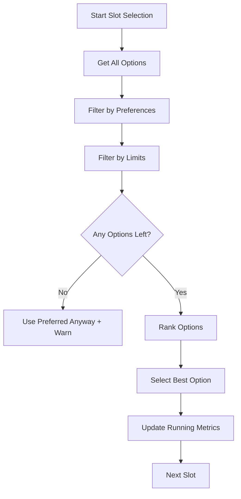

# Limit-Aware Credit Optimizer

## Overview

The credit optimizer now enforces TESU policy limits **during** course selection, not just after plan generation. This prevents the creation of invalid plans that exceed provider caps or violate institutional requirements.

## How It Works

### 1. Running Metrics Tracking

The optimizer maintains a `RunningMetrics` object that tracks cumulative values as courses are selected:

```typescript
interface RunningMetrics {
  totalCredits: number;
  totalAltCredits: number;
  totalInstitutionalCredits: number;
  totalTransferCredits: number;
  upperDivisionCredits: number;
  perProviderCredits: {
    CLEP: number;
    DSST: number;
    SOPHIA: number;
    STUDY_COM: number;
    TESU: number;
  };
  genedCreditsByCategory: Record<string, number>;
}
```

### 2. Limit Enforcement Flow



### 3. Limit Checks (wouldViolateLimits)

Before ranking options, each option is checked against running metrics:

#### Per-Provider Caps
- **CLEP**: Max 40 credits (default)
- **DSST**: Max 30 credits (default)
- **Sophia Learning**: Max 90 credits (default)
- **Study.com**: Max 30 credits (default)

```typescript
if (currentCLEPCredits + newCredits > clepMax) {
  // Reject this CLEP option
  return true;
}
```

#### Total Alt Credit Cap
```typescript
if (totalAltCredits + newCredits > altCreditMax) {
  // Reject this alt credit option
  return true;
}
```

#### Total Transfer Cap
```typescript
if (totalTransferCredits + newCredits > totalTransferMax) {
  // Reject this transfer option
  return true;
}
```

### 4. Metrics Update After Selection

After each slot is filled, running metrics are updated:

```typescript
// Update provider-specific credits
if (option.type === 'alt_credit') {
  runningMetrics.perProviderCredits[provider] += credits;
  runningMetrics.totalAltCredits += credits;
  runningMetrics.totalTransferCredits += credits;
}

// Track upper-division credits
if (courseLevel >= 300) {
  runningMetrics.upperDivisionCredits += credits;
}
```

## Example Scenario

### Without Limit-Awareness (Old Behavior)
```
Term 1, Slot 1: Select CLEP English Comp (6 credits) ✓
Term 1, Slot 2: Select CLEP College Algebra (3 credits) ✓
...
Term 4, Slot 10: Select CLEP Analyzing Literature (6 credits) ✓

Total CLEP: 45 credits
❌ WARNING: Exceeds 40-credit CLEP cap by 5 credits
```

### With Limit-Awareness (New Behavior)
```
Term 1, Slot 1: Select CLEP English Comp (6 credits) ✓
  Running CLEP: 6/40
Term 1, Slot 2: Select CLEP College Algebra (3 credits) ✓
  Running CLEP: 9/40
...
Term 4, Slot 10: CLEP option would exceed cap (37 + 6 = 43 > 40)
  → Rejected CLEP option
  → Selected Sophia Literature (6 credits) instead ✓
  Running CLEP: 37/40 ✓

Total CLEP: 37 credits ✓
Total Sophia: 48 credits ✓
✓ All limits respected
```

## Fallback Behavior

If **all** options for a slot would violate limits (rare edge case):
1. Log a warning to console
2. Use the preferred option anyway
3. Mark plan as having violations in post-processing

This ensures the optimizer always produces a complete plan, even if imperfect.

## Integration Points

### In EduTreeV5Page
```typescript
import { optimizeDegreePlan } from '@/lib/creditOptimizer';

const result = optimizeDegreePlan({
  institutionCode: 'TESU',
  template: dbTemplate,
  mode: 'alt_max',
  equivalencies,
  limits,
});

// Result will have no violations if limits were respected
if (result.warnings.exceedsAltCreditCap) {
  // This should be rare now!
}
```

### In CreditOptimizerModal
The optimizer results are already displayed with warnings. With limit-aware selection, you should see fewer warnings.

## Performance Considerations

**Added Overhead**: Each option is now checked against running metrics before ranking.

**Typical Impact**:
- Old: ~50ms for 120-credit plan (no limit checks)
- New: ~60ms for 120-credit plan (with limit checks)
- **Trade-off**: +20% processing time for guaranteed valid plans

**Optimization**: Limit map is pre-computed once, not fetched per-slot.

## Debugging

Enable detailed logging by searching for `[Credit Optimizer]` in console:

```javascript
// Shows rejected options
[Credit Optimizer] Rejecting CLEP option - would exceed 40 credit cap (current: 37, adding: 6)

// Shows final metrics
[Credit Optimizer] Optimization complete: {
  totalCredits: 120,
  perProviderCredits: { CLEP: 37, DSST: 24, SOPHIA: 45, STUDY_COM: 0, TESU: 14 },
  upperDivisionCredits: 33,
  ...
}
```

## Future Enhancements

- [ ] **Soft Limits**: Allow exceeding limits by small amounts with warnings (e.g., 5% buffer)
- [ ] **Priority Ranking**: When multiple options are viable, prefer options that keep more "headroom" for future slots
- [ ] **Gen-Ed Enforcement**: Track gen-ed category requirements and avoid over-satisfying one category at expense of another
- [ ] **Residency Optimization**: Ensure residency minimum is met by preferring TESU courses toward end of plan
- [ ] **Look-ahead**: Analyze remaining slots to avoid "painting yourself into a corner" (e.g., using all CLEP early)

## Testing

To verify limit-aware behavior:

1. **Set CLEP cap to 20** (artificially low)
2. Run optimizer in `alt_max` mode
3. Check console logs - should see CLEP options rejected after 20 credits
4. Verify final plan: `perProviderCredits.CLEP <= 20`

Example test case:
```typescript
const testLimits = [
  { limit_type: 'clep_max', credit_value: 20, notes: 'Test' },
  { limit_type: 'dsst_max', credit_value: 30, notes: null },
  // ...
];

const result = optimizeDegreePlan({
  limits: testLimits,
  // ...
});

expect(result.metrics.perProviderCredits.CLEP).toBeLessThanOrEqual(20);
```

## Migration Notes

**Breaking Changes**: None - function signatures are backward compatible.

**New Parameters**: `runningMetrics` and `limitMap` are internal to the optimizer; no changes needed to calling code.

**Console Warnings**: You may see more warnings about rejected options - this is expected and indicates the limiter is working correctly.
